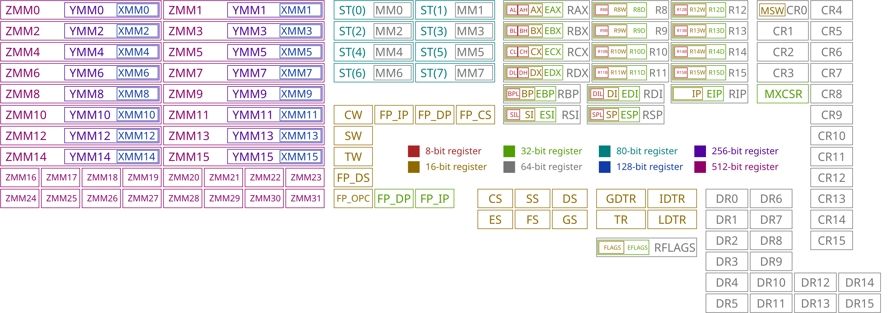
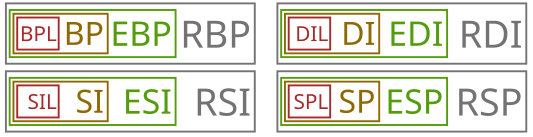
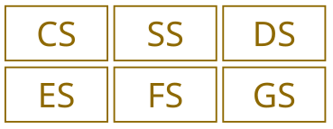

We will use x86 ASM so it will work for x86 CPUs

# How does a computer starts
1. BIOS is copied from a ROM chip into the RAM

2. BIOS starts executing code
- Hardware is initialized
- POST
(logo could pop up here)

3. BIOS searches for an OS to start
3.1 How does it find the OS
3.1.1 Legacy boot
- BIOS loads first sector of each bootable device into the memory. ! The memory location is: 0x7C00 !
- BIOS checks for 0xAA55 signature
- If found -> executing code
3.1.2 EFI (irrelevant for this OS)
- BIOS looks into special EFI partitions
- OS must be compiled as an EFI program

4. BIOS loads and start OS 

5. OS runs

# Plan what to do
Write some code (lets see) assamble it and put it in the first sector of a floppy disc (kids dont konw them anymore ._.)
Implement the signature

# Concept of x86 architecture
All processors have a number of registers (very small and fast memory)

## Gerneral purpose registers
### index registers

mainly used for keeping indices and pointers

## Status registers 
### Program counter

Keeps track of which memory location the curent instruction begins

### Flags register

contains special flags which are set by various instructions

## Segment registers

Are used to keep track of the currently active memory segments 